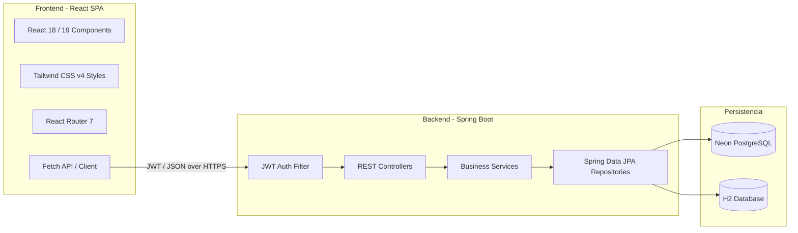

# Arquitectura del Sistema (SPA React + Spring Boot)

Esta guía presenta una descripción detallada de la arquitectura técnica, la estructura del proyecto y los principios de diseño que rigen la plataforma **AbrazaMente (`mental-app`)**. Proporciona una base conceptual indispensable para comprender cómo interactúan la Single Page Application (SPA) y el backend RESTful en Spring Boot.

---

## 🏛️ Descripción General de la Arquitectura

AbrazaMente está diseñado bajo un modelo de arquitectura desacoplada de tres capas:
1. **Capa del Cliente (Frontend)**: React Single Page Application (SPA) empaquetada mediante **Vite**. Consume recursos dinámicos desde el backend usando peticiones HTTP JSON.
2. **Capa del Servidor (Backend)**: API RESTful construida con **Java 17 + Spring Boot 3.x**. Se encarga del procesamiento de reglas de negocio, autenticación segura y persistencia.
3. **Capa de Almacenamiento (Base de Datos)**: Neon PostgreSQL en entornos de producción/staging y base de datos relacional H2 en memoria para el desarrollo local y ejecución ágil de pruebas unitarias.



---

## 📂 Screaming Architecture (Feature-First)

El frontend de la aplicación está organizado bajo el patrón **Feature-First** (a veces denominado *Screaming Architecture*, puesto que la estructura de carpetas grita de qué trata la aplicación en lugar de centrarse únicamente en categorías técnicas como `components/` o `pages/`).

### Estructura de Carpetas del Frontend (`src/`)

```text
src/
├── components/           # Componentes globales y transversales
│   ├── Header.jsx        # Barra de navegación principal y control de tema
│   ├── Footer.jsx        # Pie de página responsivo
│   └── ProtectedRoute.jsx # Guard de rutas privadas con verificación de token
├── features/             # Módulos y funcionalidades agrupadas
│   ├── auth/             # Autenticación, modales de ingreso y OAuth Google
│   ├── breathing/        # Ejercicio de respiración cuadrada 4-4-4-4
│   ├── community/        # Foro y chat social (Issue #33)
│   ├── grounding/        # Técnica interactiva 5-4-3-2-1
│   ├── journal/          # Diario emocional (Mood Tracker) con guardado local/remoto
│   ├── professionals/    # Catálogo interactivo de terapeutas voluntarios
│   └── resources/        # Biblioteca psicoeducativa categorizada (Issue #34)
├── pages/                # Vistas principales completas
│   └── Landing.jsx       # Página de inicio interactiva y centro de botiquín
├── test/                 # Suite de pruebas automatizadas del frontend
├── index.css             # Estilo CSS global (importación de Tailwind CSS v4)
├── main.jsx              # Punto de entrada de React 18/19
└── App.jsx               # Enrutador principal y diseño global de la aplicación
```

---

## ⚡ Estándares y Decisiones de Diseño

### 1. Sistema de Estilos y Estética Premium
* **Tailwind CSS v4**: El proyecto adopta la versión v4 de Tailwind CSS, la cual elimina la necesidad del archivo `tailwind.config.js` tradicional en favor de la configuración directa en `@theme` dentro de `index.css`.
* **Ajuste de Color (HSL Curado)**: Se evitan colores planos. Los degradados y componentes translúcidos (*glassmorphism*) se logran mezclando clases de opacidad (`bg-white/5`, `border-white/10`) y desenfoque (`backdrop-blur-md`).
* **Micro-animaciones**: Se utiliza **Framer Motion** para animaciones interactivas fluidas, como la expansión y contracción del círculo de respiración guiada o la aparición de tarjetas en pantalla.

### 2. Gestión de Rutas y Navegación
* **React Router (SPA)**: Se define una arquitectura de enrutamiento del lado del cliente en [App.jsx](file:///c:/Users/Ricardo/Desktop/rep/mental-app/src/App.jsx) que evita las recargas de página del navegador, manteniendo una experiencia fluida.
* **ProtectedRoute**: Encapsula las rutas privadas (como el foro `/comunidad`) y verifica la presencia del JWT y la información del usuario antes de permitir la renderización de las subrutas.

### 3. Autenticación y Seguridad
* **Token JWT**: Las llamadas a la API REST agregan el encabezado `Authorization: Bearer <token>` cuando el usuario está autenticado. El backend Spring Boot valida la firma y expira la sesión de forma sin estado (*stateless*).
* **HttpOnly Cookies (Issue #30)**: Diseñado para migrar el token de `localStorage` a Cookies seguras `HttpOnly` para mitigar ataques XSS (Cross-Site Scripting).

### 4. Integración y Despliegue Unificado
* **Maven Webapp Build**: Durante la compilación de producción, los recursos compilados por React (`npm run build` en la carpeta `/dist` o `/static`) se copian al directorio `src/main/resources/static/` de Spring Boot. De este modo, al ejecutar el comando:
  ```bash
  java -jar target/mental-app.jar
  ```
  Spring Boot actúa como servidor web estático para la SPA y expone los endpoints de la API en el mismo puerto, simplificando el despliegue a un único contenedor o Web Service (Render/Vercel).
