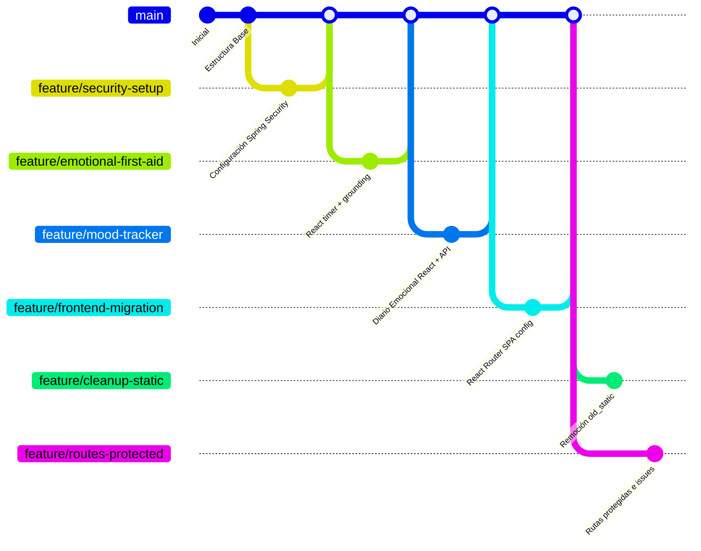

# Auditoría Completa de Ramas de Git (Branches)

Este informe técnico documenta el análisis exhaustivo del estado del repositorio de control de versiones de **AbrazaMente (`mental-app`)**. Se detallan todas las ramas activas (locales y remotas), sus últimos commits, cambios clave introducidos, su estado de fusión (*merged* o *unmerged*) con respecto a la rama `main`, y sus propósitos dentro del ciclo de desarrollo.

---

## 📊 Resumen Ejecutivo del Repositorio

El repositorio presenta una estructura organizada de ramas basadas en funcionalidades (*feature branches*). Recientemente se completó la gran migración del frontend estático a la arquitectura SPA en React, lo que llevó a la obsolescencia y posterior eliminación de las páginas HTML estáticas originales.



---

## 📂 Auditoría Detallada de Ramas Locales

A continuación se presenta un análisis pormenorizado de las **17 ramas locales** configuradas en el entorno:

### 1. `main` (Rama de Producción/Integración)
* **Último Commit**: `41612b0` - *"chore: add api proxy for local development"*
* **Estado de Fusión**: Base de integración.
* **Propósito**: Contiene el código fuente unificado y estable. En ella se encuentran integradas la arquitectura Spring Boot con seguridad JWT, la persistencia en Neon PostgreSQL, la configuración de desarrollo local en H2, la suite de pruebas unitarias, y la base de la SPA en React ( Landing, Timer, Grounding, Mood Tracker y Directorio de Terapeutas).

### 2. `feature/routes-protected` (Rama Activa Actual)
* **Último Commit**: `135c609` - *"docs: add Diario Emocional (Mood Tracker) feature to README.md"*
* **Estado de Fusión**: **Activa / No Fusionada** (`unmerged`).
* **Propósito**: Rama de trabajo actual para implementar las rutas protegidas y configurar React Router (Issue #35), así como para resolver los componentes pendientes de Recursos y Comunidad. Contiene la eliminación de scripts residuales (generador de diapositivas) y colecciones antiguas de Bruno API Client.

### 3. `feature/cleanup-static`
* **Último Commit**: `5bd5c3a` - *"refactor: remove legacy static HTML/JS/CSS files after React migration"*
* **Estado de Fusión**: **Activa / No Fusionada** (`unmerged`).
* **Propósito**: Esta rama contiene el trabajo de saneamiento y limpieza del código heredado de la fase estática. Elimina más de 40 archivos de maquetación HTML, CSS y JS obsoletos dentro de `old_static/` y `src/main/resources/old_static/` para evitar vulnerabilidades de dependencias y simplificar la estructura del proyecto.

### 4. `feature/fix-auth-test`
* **Último Commit**: `0e5c0ea` - *"security: fix disabled CSRF protection by using ignoringRequestMatchers"*
* **Estado de Fusión**: **Activa / No Fusionada** (`unmerged`).
* **Propósito**: Soluciona fallos en las pruebas automatizadas del controlador de autenticación (`AuthControllerTest`) causados por la desactivación incorrecta de políticas de CSRF en entornos de desarrollo/testeo.

### 5. `feature/sanitize-secrets`
* **Último Commit**: `135c609` (Alineado con `routes-protected`).
* **Estado de Fusión**: **Activa / No Fusionada** (`unmerged`).
* **Propósito**: Rama dedicada a limpiar credenciales expuestas en archivos de configuración e historiales git. Asegura que claves como `JWT_SECRET` se inyecten mediante variables de entorno en producción y mantengan valores seguros por defecto en entornos de desarrollo.

### Ramas Locales Ya Fusionadas en `main`

Estas ramas ya han sido completamente mezcladas y sus aportaciones forman parte del núcleo principal del proyecto:

* **`agregar-propiedades` (`b738c18`)**: Configuración e integración de canalizaciones CI con GitHub Actions (Maven, CodeQL, Neon DB Branches, Sourcery AI) para garantizar la calidad y seguridad en cada PR.
* **`feature-tienda-online` (`e9c0c48`)**: Integración inicial del módulo de profesionales clínicos con sembrado de datos en la base de datos eliminando datos falsos/hardcodeados (*mocks*) del frontend.
* **`feature/clinician-directory` (`5cc3380`)**: Creación de la vista interactiva del directorio de psicólogos y configuración de políticas de seguridad pública para permitir consultas sin token JWT en el catálogo.
* **`feature/emotional-first-aid` (`1feae78`)**: Configuración e inicialización del proyecto React SPA con Vite, agregando el timer de respiración 4-7-8 con animaciones Fluidas y el Grounding Wizard 5-4-3-2-1.
* **`feature/frontend-migration` (`6288006`)**: Migración general de las vistas a la SPA de React e integración inicial de React Router y build de empaquetado unificado en Maven.
* **`feature/mood-tracker` (`dacecfe`)**: Desarrollo del diario de calma interactivo (`MoodTracker.jsx`) y su integración con los controladores API de Java Spring Boot.
* **`feature/screaming-architecture` (`ee5f4ae`)**: Reorganización estructural de carpetas del frontend a un formato *feature-first* (Screaming Architecture) y habilitación de CORS para permitir despliegues desacoplados (Vercel para frontend y Render para backend).
* **`feature/security-setup` (`c7943f5`)**: Implementación del middleware de seguridad en Spring Boot con JWT y hashing de contraseñas mediante BCrypt.
* **`feature/vercel-deployment` (`ee5f4ae`)**: Configuración del archivo `vercel.json` y endpoints dinámicos para el correcto enrutamiento SPA en despliegues sobre Vercel.
* **`readme` (`f6c352c`)**: Redacción integral de la documentación del proyecto con diagramas de flujo y arquitectura detallada.
* **`refactor/remove-duplicate-frontend` (`66bd9ca`)**: Limpieza de carpetas duplicadas de frontend para mantener una única raíz de código consolidada.
* **`style/fix-sourcery-braces` (`1badd57`)**: Corrección de estilos de llaves en Spring Boot sugeridos por la revisión de Sourcery AI.

---

## 🌐 Mapeo de Ramas Remotas de Upstream (Colaboración)

El repositorio cuenta con ramas de seguimiento remoto que indican integraciones de múltiples colaboradores y fases de trabajo:

* **`upstream/Auth_google` y `Google_auth_responsive`**: Ramas dedicadas al desarrollo de la integración del inicio de sesión OAuth con Google de forma responsiva.
* **`upstream/Pagina-recursos` y `Solucion-color-recursos`**: Contienen las implementaciones iniciales y de diseño de colores de la biblioteca psicoeducativa estática.
* **`upstream/frontend-comunidad`**: Contiene la base del muro de la comunidad estático antes de la unificación.
* **`upstream/login` y `login-final`**: Contiene las interfaces HTML/CSS del login y registro previas a la migración a React.

---

## 💡 Recomendaciones del Ciclo de Vida de Git

1. **Eliminar Ramas Locales Fusionadas**: Ramas como `feature/emotional-first-aid` o `feature/mood-tracker` pueden ser eliminadas de forma segura de los entornos locales para limpiar la interfaz del editor de código:
   ```powershell
   git branch -d feature/emotional-first-aid
   git branch -d feature/mood-tracker
   # Repetir para el resto de ramas marcadas como fusionadas (merged)
   ```
2. **Rebasar con Frecuencia**: Antes de continuar con cualquier tarea de migración, se recomienda rebasar la rama activa con respecto a `main` para evitar conflictos:
   ```powershell
   git checkout feature/routes-protected
   git pull origin main --rebase
   ```
