# Ingreso y Registro Seguro: Google OAuth 2.0 (Issue #30)

Esta guía técnica documenta la migración y reestructuración completa de la pantalla de autenticación (**`AuthModal.jsx`**) de **AbrazaMente**, integrando el inicio de sesión tradicional y el soporte nativo para **Google OAuth 2.0 Identity Services**.

---

## 🎨 Diagrama de Flujo de Autenticación Híbrida

El frontend interactúa tanto de forma tradicional (correo y contraseña hashed) como de forma federada (Google Sign-In) entregando seguridad criptográfica:

```mermaid
sequenceDiagram
    participant U as React SPA Client
    participant G as Google Identity API
    participant API as Spring Boot Backend

    rect rgb(30, 30, 40)
        Note over U, G: Flujo de Inicio de Sesión Federado con Google
        U->>G: Desplegar Botón Google Sign-In
        U->>G: Usuario inicia sesión en Pop-up Google
        G-->>U: Retorna credentialToken (JWT Firmado)
        U->>API: POST /api/auth/google (con credentialToken)
        API->>API: Valida firma JWT contra servidores Google
        API-->>U: HTTP Set-Cookie HttpOnly (Sesión activa)
    end
```



---

## 🛠️ Código Completo del Módulo de Autenticación

### 1. Integración de Componente de Login y Registro (`AuthModal.jsx`)

Este componente replica el diseño responsivo del archivo estático original `login.html`. Gestiona el alternador de pestañas (Tabs), los formularios dinámicos y la inicialización asíncrona del cliente JavaScript de Google Identity Services:

```javascript
// src/features/auth/AuthModal.jsx
import React, { useState, useEffect } from 'react';
import { Mail, Lock, LogIn, ChevronRight } from 'lucide-react';

export default function AuthModal({ onLogin }) {
  const [isLoginTab, setIsLoginTab] = useState(true);
  const [email, setEmail] = useState('');
  const [password, setPassword] = useState('');
  const [loading, setLoading] = useState(false);
  const [errorMessage, setErrorMessage] = useState('');

  // 1. Inicializar botón de inicio de sesión nativo con Google
  useEffect(() => {
    /* global google */
    if (typeof google !== 'undefined') {
      google.accounts.id.initialize({
        client_id: "MOCK_GOOGLE_CLIENT_ID_CONFIGURED_IN_PROD.apps.googleusercontent.com",
        callback: handleGoogleCredentialResponse
      });
      google.accounts.id.renderButton(
        document.getElementById("google-signin-btn"),
        { theme: "dark", size: "large", text: "continue_with", width: "100%" }
      );
    }
  }, [isLoginTab]);

  const handleGoogleCredentialResponse = async (response) => {
    try {
      setLoading(true);
      const token = response.credential;
      const res = await fetch('/api/auth/google', {
        method: 'POST',
        headers: {
          'Content-Type': 'application/json'
        },
        body: JSON.stringify({ credentialToken: token })
      });
      if (!res.ok) throw new Error("Google Authentication failed");
      const data = await res.json();
      onLogin(data);
    } catch (e) {
      setErrorMessage("Error de conexión al iniciar sesión con Google.");
    } finally {
      setLoading(false);
    }
  };

  const handleSubmit = async (e) => {
    e.preventDefault();
    if (!email || !password) return;
    
    try {
      setLoading(false);
      setErrorMessage('');
      const endpoint = isLoginTab ? '/api/auth/login' : '/api/auth/register';
      
      const response = await fetch(endpoint, {
        method: 'POST',
        headers: {
          'Content-Type': 'application/json'
        },
        body: JSON.stringify({ username: email, password })
      });

      if (!response.ok) {
        throw new Error("Credenciales inválidas");
      }
      
      const data = await response.json();
      onLogin(data);
    } catch (err) {
      setErrorMessage("Correo o contraseña incorrectos. Por favor, reintenta.");
    }
  };

  return (
    <div className="grid grid-cols-1 lg:grid-cols-2 gap-0 min-h-[80vh] bg-white/5 border border-white/10 rounded-3xl overflow-hidden shadow-2xl">
      
      {/* Columna Izquierda: Ilustración de Órbitas Premium */}
      <div className="hidden lg:flex flex-col justify-between p-12 bg-gradient-to-br from-[#1E1E20] to-[#0A0A0B] relative overflow-hidden border-r border-white/10">
        <div className="absolute inset-0 -z-10">
          <div className="absolute top-[20%] left-[20%] w-[60%] h-[60%] rounded-full bg-blue-600/10 blur-[100px]" />
        </div>

        {/* Cabecera Hero */}
        <div className="space-y-4">
          <div className="inline-flex items-center gap-1.5 bg-white/5 border border-white/10 px-3.5 py-1 rounded-full text-xs font-bold text-gray-400">
            <span className="w-1.5 h-1.5 rounded-full bg-blue-500" /> Plataforma de Bienestar
          </div>
          <h2 className="text-3xl font-extrabold text-white leading-tight">
            Tu bienestar comienza <br />
            con una conversación.
          </h2>
        </div>

        {/* Órbitas en Movimiento (Visual Ilustrativa) */}
        <div className="relative w-full aspect-square flex items-center justify-center max-w-[280px] mx-auto my-8">
          <div className="absolute w-24 h-24 rounded-full bg-gradient-to-br from-blue-500 to-purple-600 flex items-center justify-center text-white text-3xl font-bold shadow-lg shadow-blue-500/20 z-10 animate-pulse">
            ❤
          </div>
          {/* Órbitas rotatorias decorativas */}
          <div className="absolute border border-white/10 rounded-full w-40 h-40 animate-[spin_10s_linear_infinite]" />
          <div className="absolute border border-white/5 rounded-full w-56 h-56 animate-[spin_15s_linear_infinite_reverse]" />
        </div>

        <p className="text-xs text-gray-500 leading-relaxed">
          Al ingresar, accedes a un entorno de contención seguro y 100% moderado por profesionales de la salud.
        </p>
      </div>

      {/* Columna Derecha: Formulario de Autenticación */}
      <div className="p-8 md:p-12 flex flex-col justify-center space-y-8 bg-[#1A1A1C]">
        
        {/* Cambiador de Pestaña */}
        <div className="flex border-b border-white/10">
          <button
            onClick={() => setIsLoginTab(true)}
            className={`flex-1 text-center font-bold text-sm pb-3.5 transition ${isLoginTab ? 'text-blue-400 border-b-2 border-blue-500' : 'text-gray-400 hover:text-white'}`}
          >
            Iniciar Sesión
          </button>
          <button
            onClick={() => setIsLoginTab(false)}
            className={`flex-1 text-center font-bold text-sm pb-3.5 transition ${!isLoginTab ? 'text-blue-400 border-b-2 border-blue-500' : 'text-gray-400 hover:text-white'}`}
          >
            Crear Cuenta
          </button>
        </div>

        {/* Mensaje de Error */}
        {errorMessage && (
          <div className="bg-red-500/10 border border-red-500/25 p-4 rounded-xl text-xs text-red-400 text-center font-semibold">
            {errorMessage}
          </div>
        )}

        {/* Formulario */}
        <form onSubmit={handleSubmit} className="space-y-4">
          <div>
            <label className="block text-[10px] font-bold text-gray-400 uppercase mb-1.5">Correo Electrónico</label>
            <div className="relative">
              <Mail className="w-4 h-4 text-gray-500 absolute left-3.5 top-3.5" />
              <input
                type="email"
                required
                value={email}
                onChange={(e) => setEmail(e.target.value)}
                placeholder="ejemplo@abrazamente.cl"
                className="w-full bg-white/5 border border-white/10 rounded-xl pl-10 pr-4 py-3 text-xs text-white focus:outline-none focus:border-blue-500 placeholder-gray-600"
              />
            </div>
          </div>

          <div>
            <label className="block text-[10px] font-bold text-gray-400 uppercase mb-1.5">Contraseña</label>
            <div className="relative">
              <Lock className="w-4 h-4 text-gray-500 absolute left-3.5 top-3.5" />
              <input
                type="password"
                required
                value={password}
                onChange={(e) => setPassword(e.target.value)}
                placeholder="••••••••"
                className="w-full bg-white/5 border border-white/10 rounded-xl pl-10 pr-4 py-3 text-xs text-white focus:outline-none focus:border-blue-500 placeholder-gray-600"
              />
            </div>
          </div>

          <button
            type="submit"
            disabled={loading}
            className="w-full flex items-center justify-center gap-2 bg-blue-600 hover:bg-blue-500 text-white font-bold py-3.5 rounded-xl transition shadow-lg shadow-blue-600/15"
          >
            <LogIn className="w-4 h-4" /> {isLoginTab ? 'Iniciar sesión ahora' : 'Registrar nueva cuenta'}
          </button>
        </form>

        {/* Separador */}
        <div className="relative flex py-2 items-center">
          <div className="flex-grow border-t border-white/10"></div>
          <span className="flex-shrink mx-4 text-gray-500 text-[10px] font-bold uppercase tracking-wider">O continuar con</span>
          <div className="flex-grow border-t border-white/10"></div>
        </div>

        {/* Botón de Google OAuth */}
        <div className="space-y-3">
          <div id="google-signin-btn" className="w-full overflow-hidden rounded-xl"></div>
        </div>

      </div>

    </div>
  );
}
```
