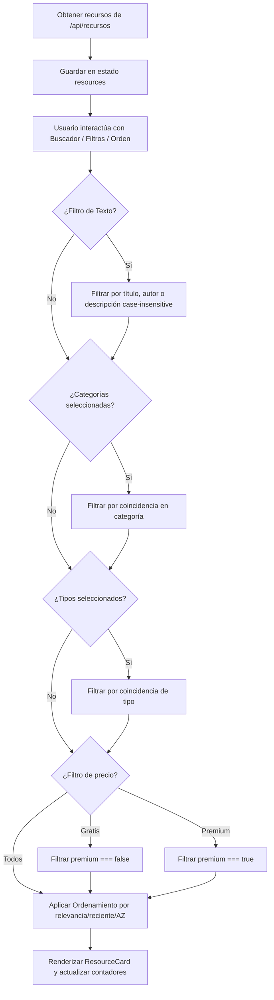

# Módulo de Biblioteca Psicoeducativa (Issue #34)

Esta guía técnica describe en detalle la implementación y el consumo del módulo **Biblioteca Psicoeducativa (`ResourceLibrary.jsx`)**, abarcando la barra de búsqueda avanzada, la barra lateral de filtros multinivel (`FilterBar.jsx`), las tarjetas de recursos (`ResourceCard.jsx`) y el almacenamiento en historial local de navegación.

---

## 🎨 Diagrama de Flujo del Proceso de Filtrado de Recursos



---

## 🛠️ Código Completo del Módulo de Recursos

### 1. Ficha de Recursos (`ResourceCard.jsx`)
Renderiza las propiedades del recurso, añade indicadores visuales para los contenidos clínicos premium y contiene disparadores interactivos de eventos:

```javascript
// src/features/resources/ResourceCard.jsx
import React from 'react';
import { Book, Video, Headphones, FileText, Share2, Award, Eye, Play } from 'lucide-react';

export default function ResourceCard({ resource, onSelect, onPlayVideo }) {
  // Asignación dinámica de iconos
  const getIcon = (type) => {
    switch (type.toLowerCase()) {
      case 'video':
        return <Video className="w-4 h-4 text-rose-400" />;
      case 'podcast':
        return <Headphones className="w-4 h-4 text-emerald-400" />;
      case 'libro':
        return <Book className="w-4 h-4 text-amber-400" />;
      default:
        return <FileText className="w-4 h-4 text-blue-400" />;
    }
  };

  return (
    <div className="bg-white/5 border border-white/10 rounded-2xl p-5 hover:border-purple-500/50 transition-all duration-300 flex flex-col justify-between group shadow-lg hover:shadow-purple-500/5">
      <div>
        {/* Cabecera / Tags */}
        <div className="flex justify-between items-start mb-4">
          <span className="flex items-center gap-1.5 bg-white/5 px-2.5 py-1 rounded-lg text-xs font-semibold text-gray-300 border border-white/5">
            {getIcon(resource.tipo)}
            {resource.tipo}
          </span>
          {resource.premium && (
            <span className="flex items-center gap-1 bg-purple-500/20 text-purple-300 border border-purple-500/35 px-2 py-0.5 rounded-lg text-[9px] font-extrabold tracking-wide uppercase">
              <Award className="w-3 h-3 text-purple-400" /> Premium
            </span>
          )}
        </div>

        {/* Título y Metadatos */}
        <h4 className="text-base font-bold text-white group-hover:text-purple-400 transition-colors duration-200 mb-1 leading-snug line-clamp-2">
          {resource.titulo}
        </h4>
        <p className="text-xs text-gray-400 mb-3 font-medium">Por: {resource.autor} · {resource.editorial || 'Clínica AbrazaMente'}</p>
        <p className="text-sm text-gray-300 leading-relaxed line-clamp-3 mb-5">
          {resource.descripcion}
        </p>
      </div>

      {/* Botones de acción inferior */}
      <div className="flex gap-2 pt-4 border-t border-white/5">
        <button
          onClick={() => onSelect(resource)}
          className="flex-1 flex items-center justify-center gap-1.5 bg-white/5 hover:bg-white/10 text-white text-xs font-semibold py-2.5 rounded-xl border border-white/10 transition-colors active:scale-95"
        >
          <Eye className="w-3.5 h-3.5" /> Detalles
        </button>
        {resource.tipo.toLowerCase() === 'video' && resource.urlVideo && (
          <button
            onClick={() => onPlayVideo(resource.urlVideo)}
            className="bg-purple-600 hover:bg-purple-500 text-white text-xs font-semibold px-4 py-2.5 rounded-xl flex items-center gap-1 transition-all active:scale-95"
          >
            <Play className="w-3 h-3 fill-current" /> Reproducir
          </button>
        )}
      </div>
    </div>
  );
}
```

---

### 2. Panel de Búsqueda y Filtros Lateral (`FilterBar.jsx`)
Administra los selectores de categorías, filtrado binario de precio y reinicio de filtros:

```javascript
// src/features/resources/FilterBar.jsx
import React from 'react';
import { Filter, RotateCcw, Check } from 'lucide-react';

export default function FilterBar({ filters, setFilters, categories, types, onClear, resources }) {
  
  // Calcular cantidad dinámica de ítems por categoría
  const getCountByCategory = (cat) => resources.filter(r => r.categoria === cat).length;
  const getCountByType = (type) => resources.filter(r => r.tipo === type).length;

  const handleCategoryChange = (cat) => {
    const active = filters.categories.includes(cat)
      ? filters.categories.filter(c => c !== cat)
      : [...filters.categories, cat];
    setFilters(prev => ({ ...prev, categories: active }));
  };

  const handleTypeChange = (type) => {
    const active = filters.types.includes(type)
      ? filters.types.filter(t => t !== type)
      : [...filters.types, type];
    setFilters(prev => ({ ...prev, types: active }));
  };

  return (
    <aside className="w-full lg:w-64 bg-white/5 border border-white/10 rounded-2xl p-5 space-y-6 flex-shrink-0">
      
      {/* Cabecera */}
      <div className="flex justify-between items-center pb-3 border-b border-white/10">
        <h3 className="text-sm font-bold text-white flex items-center gap-2">
          <Filter className="w-4 h-4 text-purple-400" /> Filtrar recursos
        </h3>
        <button onClick={onClear} className="text-xs text-gray-400 hover:text-white flex items-center gap-1 transition-colors">
          <RotateCcw className="w-3 h-3" /> Limpiar
        </button>
      </div>

      {/* Temas / Categorías */}
      <div className="space-y-2">
        <h4 className="text-xs font-bold text-gray-400 uppercase tracking-wider">Temáticas</h4>
        <div className="space-y-2 max-h-48 overflow-y-auto pr-2 scrollbar-thin scrollbar-thumb-white/10">
          {categories.map(cat => (
            <label key={cat} className="flex items-center justify-between text-sm text-gray-300 cursor-pointer hover:text-white group">
              <span className="flex items-center gap-2">
                <input
                  type="checkbox"
                  checked={filters.categories.includes(cat)}
                  onChange={() => handleCategoryChange(cat)}
                  className="rounded border-white/10 bg-white/5 text-purple-600 focus:ring-0 w-4 h-4"
                />
                {cat}
              </span>
              <span className="text-xs text-gray-500 group-hover:text-gray-300">({getCountByCategory(cat)})</span>
            </label>
          ))}
        </div>
      </div>

      {/* Tipo de recurso */}
      <div className="space-y-2">
        <h4 className="text-xs font-bold text-gray-400 uppercase tracking-wider">Formato</h4>
        <div className="space-y-2">
          {types.map(t => (
            <label key={t} className="flex items-center justify-between text-sm text-gray-300 cursor-pointer hover:text-white group">
              <span className="flex items-center gap-2">
                <input
                  type="checkbox"
                  checked={filters.types.includes(t)}
                  onChange={() => handleTypeChange(t)}
                  className="rounded border-white/10 bg-white/5 text-purple-600 focus:ring-0 w-4 h-4"
                />
                {t}
              </span>
              <span className="text-xs text-gray-500 group-hover:text-gray-300">({getCountByType(t)})</span>
            </label>
          ))}
        </div>
      </div>

      {/* Disponibilidad */}
      <div className="space-y-2">
        <h4 className="text-xs font-bold text-gray-400 uppercase tracking-wider">Precio</h4>
        <div className="space-y-2">
          {['Todos', 'Gratuitos', 'Premium'].map(opt => (
            <label key={opt} className="flex items-center gap-2 text-sm text-gray-300 cursor-pointer hover:text-white">
              <input
                type="radio"
                name="price"
                checked={filters.price === opt.toLowerCase()}
                onChange={() => setFilters(prev => ({ ...prev, price: opt.toLowerCase() }))}
                className="bg-white/5 border-white/10 text-purple-600 focus:ring-0 w-4 h-4"
              />
              {opt}
            </label>
          ))}
        </div>
      </div>

    </aside>
  );
}
```

---

### 3. Componente Integrador de la Biblioteca (`ResourceLibrary.jsx`)
Gestiona el consumo de `/api/recursos`, la lógica de búsqueda reactiva por palabras clave y el historial de navegación persistido en `localStorage` (limitado a los 4 elementos más recientes):

```javascript
// src/features/resources/ResourceLibrary.jsx
import React, { useState, useEffect } from 'react';
import { BookOpen, Search, X, Award, ExternalLink, Calendar } from 'lucide-react';
import FilterBar from './FilterBar';
import ResourceCard from './ResourceCard';

export default function ResourceLibrary() {
  const [resources, setResources] = useState([]);
  const [filtered, setFiltered] = useState([]);
  const [loading, setLoading] = useState(true);
  const [search, setSearch] = useState('');
  const [selectedResource, setSelectedResource] = useState(null);
  const [activeVideo, setActiveVideo] = useState(null);
  const [recent, setRecent] = useState([]);
  const [sortBy, setSortBy] = useState('relevancia');

  const [filters, setFilters] = useState({
    categories: [],
    types: [],
    price: 'todos'
  });

  // 1. Obtener recursos desde la API Backend
  useEffect(() => {
    const fetchResources = async () => {
      try {
        setLoading(true);
        const response = await fetch('/api/recursos');
        if (!response.ok) throw new Error("HTTP error " + response.status);
        const data = await response.json();
        setResources(data);
        setFiltered(data);
      } catch (e) {
        console.warn("Backend no disponible. Cargando recursos de respaldo local.");
        
        // Mock data psicoeducativo estructurado
        const fallbackData = [
          { id: 1, titulo: "Superar la Ansiedad de Exámenes con TCC", autor: "Dra. Elisa Valdés", tipo: "Artículo", categoria: "Ansiedad", descripcion: "Guía práctica con ejercicios de Terapia Cognitivo Conductual orientados a la desensibilización sistemática.", premium: false },
          { id: 2, titulo: "Mindfulness y Respiración Diafragmática", autor: "Prof. Mateo Rivas", tipo: "Video", urlVideo: "https://www.youtube.com/embed/dQw4w9WgXcQ", categoria: "Meditación", descripcion: "Sesión audiovisual explicativa de 10 minutos para control de crisis de pánico.", premium: false },
          { id: 3, titulo: "Manual Clínico de Terapia de Aceptación", autor: "Dr. Carlos Cohen", tipo: "Libro", categoria: "Psicología Clínica", descripcion: "Manual técnico para psicólogos y terapeutas sobre la flexibilidad psicológica.", premium: true },
          { id: 4, titulo: "Hábitos Saludables para Estudiantes", autor: "Clínica AbrazaMente", tipo: "Infografía", categoria: "Rutinas", descripcion: "Ficha descargable en formato digital con pautas de higiene del sueño y alimentación consciente.", premium: false }
        ];
        setResources(fallbackData);
        setFiltered(fallbackData);
      } finally {
        setLoading(false);
      }
    };
    
    fetchResources();
    
    // Cargar historial de vistos recientemente
    const saved = localStorage.getItem('recent_resources');
    if (saved) {
      try {
        setRecent(JSON.parse(saved));
      } catch (err) {
        console.error(err);
      }
    }
  }, []);

  // 2. Filtrado y Ordenamiento Combinado
  useEffect(() => {
    let result = [...resources];

    // Filtro de Texto (Buscador)
    if (search.trim()) {
      const q = search.toLowerCase();
      result = result.filter(r => 
        r.titulo.toLowerCase().includes(q) || 
        r.autor.toLowerCase().includes(q) || 
        r.descripcion.toLowerCase().includes(q)
      );
    }

    // Filtro de Categoría (Temática)
    if (filters.categories.length > 0) {
      result = result.filter(r => filters.categories.includes(r.categoria));
    }

    // Filtro de Formato (Tipo de recurso)
    if (filters.types.length > 0) {
      result = result.filter(r => filters.types.includes(r.tipo));
    }

    // Filtro de Disponibilidad (Precio)
    if (filters.price === 'gratuitos') {
      result = result.filter(r => !r.premium);
    } else if (filters.price === 'premium') {
      result = result.filter(r => r.premium);
    }

    // Ordenamiento Dinámico
    if (sortBy === 'az') {
      result.sort((a, b) => a.titulo.localeCompare(b.titulo));
    } else if (sortBy === 'za') {
      result.sort((a, b) => b.titulo.localeCompare(a.titulo));
    }

    setFiltered(result);
  }, [search, filters, resources, sortBy]);

  const handleSelectResource = (resource) => {
    setSelectedResource(resource);
    
    // Persistencia limpia de navegación sin duplicación (límite de 4 elementos)
    const updated = [resource, ...recent.filter(r => r.id !== resource.id)].slice(0, 4);
    setRecent(updated);
    localStorage.setItem('recent_resources', JSON.stringify(updated));
  };

  const handleClearFilters = () => {
    setFilters({ categories: [], types: [], price: 'todos' });
    setSearch('');
    setSortBy('relevancia');
  };

  const uniqueCategories = [...new Set(resources.map(r => r.categoria))];
  const uniqueTypes = [...new Set(resources.map(r => r.tipo))];

  return (
    <div className="space-y-6">
      
      {/* Encabezado y Barra Superior */}
      <div className="flex justify-between items-center border-b border-white/10 pb-4">
        <div>
          <h2 className="text-xl font-bold text-white flex items-center gap-2">
            <BookOpen className="w-5 h-5 text-purple-400" />
            Biblioteca de Calma
          </h2>
          <p className="text-xs text-gray-400 mt-1">Recursos avalados y curados por profesionales de la salud mental.</p>
        </div>

        {/* Ordenador */}
        <select
          value={sortBy}
          onChange={(e) => setSortBy(e.target.value)}
          className="bg-white/5 border border-white/10 rounded-xl px-3 py-2 text-xs text-gray-300 focus:outline-none focus:border-purple-500"
        >
          <option value="relevancia" className="bg-[#1E1E20]">Relevancia</option>
          <option value="az" className="bg-[#1E1E20]">Título (A–Z)</option>
          <option value="za" className="bg-[#1E1E20]">Título (Z–A)</option>
        </select>
      </div>

      {/* Buscador */}
      <div className="relative">
        <Search className="w-5 h-5 text-gray-400 absolute left-4 top-3.5" />
        <input
          type="text"
          value={search}
          onChange={(e) => setSearch(e.target.value)}
          placeholder="Busca por título, autor, editorial o síntoma..."
          className="w-full bg-white/5 border border-white/10 rounded-2xl pl-12 pr-4 py-3 text-sm text-white placeholder-gray-400 focus:outline-none focus:border-purple-500 transition-colors"
        />
        {search && (
          <button onClick={() => setSearch('')} className="absolute right-4 top-3.5 text-gray-400 hover:text-white">
            <X className="w-4 h-4" />
          </button>
        )}
      </div>

      <div className="flex flex-col lg:flex-row gap-6">
        {/* Barra de Filtros */}
        <FilterBar
          filters={filters}
          setFilters={setFilters}
          categories={uniqueCategories}
          types={uniqueTypes}
          onClear={handleClearFilters}
          resources={resources}
        />

        {/* Grid de Recursos */}
        <div className="flex-1 space-y-6">
          {loading ? (
            <div className="grid grid-cols-1 md:grid-cols-2 gap-6">
              {[1, 2, 3, 4].map(n => (
                <div key={n} className="bg-white/5 border border-white/10 rounded-2xl p-5 h-48 animate-pulse" />
              ))}
            </div>
          ) : filtered.length === 0 ? (
            <div className="bg-white/5 border border-white/10 rounded-2xl p-12 text-center text-gray-400">
              No hay recursos disponibles que coincidan con la búsqueda.
            </div>
          ) : (
            <div className="grid grid-cols-1 md:grid-cols-2 gap-6">
              {filtered.map(res => (
                <ResourceCard
                  key={res.id}
                  resource={res}
                  onSelect={handleSelectResource}
                  onPlayVideo={setActiveVideo}
                />
              ))}
            </div>
          )}

          {/* Historial Navegación */}
          {recent.length > 0 && (
            <div className="pt-6 border-t border-white/10">
              <h3 className="text-sm font-bold text-white mb-4">Vistos recientemente</h3>
              <div className="grid grid-cols-2 sm:grid-cols-4 gap-4">
                {recent.map(res => (
                  <div
                    key={res.id}
                    onClick={() => handleSelectResource(res)}
                    className="bg-white/5 hover:bg-white/10 border border-white/10 p-3.5 rounded-xl cursor-pointer transition text-xs text-center space-y-1"
                  >
                    <span className="font-semibold text-white block truncate">{res.titulo}</span>
                    <span className="text-purple-400 text-[10px] uppercase font-bold">{res.tipo}</span>
                  </div>
                ))}
              </div>
            </div>
          )}
        </div>
      </div>

      {/* Modal Detalle */}
      {selectedResource && (
        <div className="fixed inset-0 bg-black/60 backdrop-blur-sm z-50 flex items-center justify-center p-4">
          <div className="bg-[#1E1E20] border border-white/10 rounded-2xl w-full max-w-lg p-6 relative shadow-2xl">
            <button 
              onClick={() => setSelectedResource(null)} 
              className="absolute top-4 right-4 text-gray-400 hover:text-white"
            >
              <X className="w-5 h-5" />
            </button>
            
            <div className="flex items-center gap-2 mb-2">
              <span className="text-xs bg-purple-500/15 text-purple-400 border border-purple-500/20 px-2 py-0.5 rounded-md font-semibold">
                {selectedResource.tipo}
              </span>
              <span className="text-xs text-gray-400 font-semibold">{selectedResource.categoria}</span>
            </div>

            <h3 className="text-xl font-bold text-white mb-2">{selectedResource.titulo}</h3>
            <p className="text-xs text-gray-400 mb-4">Creado por: {selectedResource.autor}</p>
            
            <p className="text-sm text-gray-300 mb-6 leading-relaxed bg-white/5 p-4 rounded-xl border border-white/5">
              {selectedResource.descripcion}
            </p>

            <div className="flex gap-3">
              <button 
                onClick={() => setSelectedResource(null)}
                className="flex-1 bg-purple-600 hover:bg-purple-500 text-white text-sm font-bold py-3 rounded-xl transition"
              >
                Acceder a Material Completo
              </button>
            </div>
          </div>
        </div>
      )}

      {/* Modal Reproducción Video */}
      {activeVideo && (
        <div className="fixed inset-0 bg-black/85 backdrop-blur-sm z-50 flex items-center justify-center p-4">
          <div className="bg-black border border-white/10 rounded-2xl w-full max-w-3xl overflow-hidden relative">
            <button 
              onClick={() => setActiveVideo(null)} 
              className="absolute top-4 right-4 text-white bg-black/40 p-2 rounded-full hover:bg-black/60 z-10 transition"
            >
              <X className="w-5 h-5" />
            </button>
            <div className="aspect-video w-full">
              <iframe
                src={activeVideo}
                title="AbrazaMente Video Stream"
                className="w-full h-full border-none"
                allow="accelerometer; autoplay; clipboard-write; encrypted-media; gyroscope; picture-in-picture"
                allowFullScreen
              />
            </div>
          </div>
        </div>
      )}

    </div>
  );
}
```
