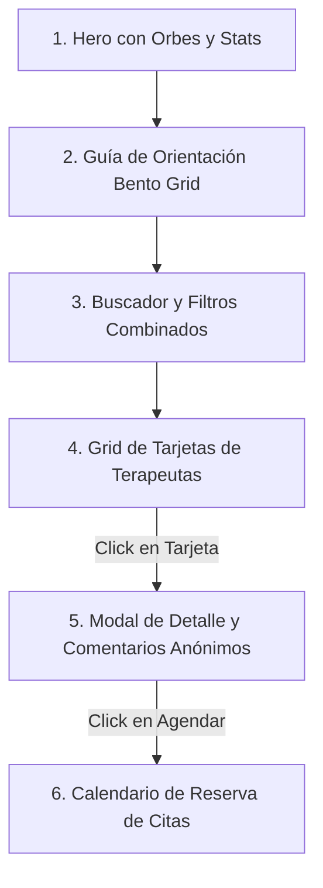

# Red de Terapeutas: Directorio Clínico y Reservas (Issue #31/#33)

Esta guía detalla la implementación y migración del catálogo de terapeutas y psicólogos (**`ProfessionalDirectory.jsx`**) desde el código estático (`terapia.html` y `terapia.js`) hacia la arquitectura **React SPA + Tailwind CSS v4**. Se describe la maquetación de tarjetas, el buscador reactivo, los filtros combinados, el modal de detalles clínicos con comentarios anónimos y el flujo de agendamiento.

---

## 🎨 Diagrama de Arquitectura de la Interfaz

La vista está diseñada en tres secciones responsivas alineadas a la marca de **AbrazaMente**:



---

## 🛠️ Código Completo del Módulo de Terapia

### 1. Ficha del Terapeuta (`ProfessionalCard.jsx`)

Dibuja los avatares calculando iniciales y asignando colores neutros, tags descriptivos del enfoque del terapeuta y el botón de acción:

```javascript
// src/features/professionals/ProfessionalCard.jsx
import React from 'react';
import { User, Award, ShieldCheck } from 'lucide-react';

export default function ProfessionalCard({ professional, onClick }) {
  // Generar iniciales limpiando títulos
  const getIniciales = (nombre) => {
    const partes = nombre.replace(/^(Dra?\.|Lic\.)\s*/i, "").split(" ");
    return ((partes[0]?.[0] || "") + (partes[1]?.[0] || "")).toUpperCase();
  };

  // Color neutral según sexo
  const getAvatarColor = (sexo) => {
    return sexo === "Mujer" 
      ? 'bg-[#B7A6D6] text-purple-900' 
      : 'bg-[#5B8C7B] text-emerald-950';
  };

  return (
    <article 
      onClick={() => onClick(professional.id)}
      className="bg-white/5 border border-white/10 hover:border-blue-500/50 p-6 rounded-3xl cursor-pointer transition-all duration-300 hover:shadow-xl hover:shadow-blue-500/5 flex flex-col justify-between h-full group"
    >
      <div className="space-y-4">
        {/* Cabecera / Info del Terapeuta */}
        <div className="flex gap-4 items-center">
          <div className={`w-12 h-12 rounded-full flex items-center justify-center font-bold text-base shadow-inner ${getAvatarColor(professional.sexo)}`}>
            {getIniciales(professional.nombre)}
          </div>
          <div>
            <h3 className="font-bold text-white group-hover:text-blue-400 transition-colors leading-snug">
              {professional.nombre}
            </h3>
            <p className="text-xs text-gray-400 font-semibold">{professional.especialidad}</p>
          </div>
        </div>

        {/* Descripción Breve */}
        <p className="text-sm text-gray-300 leading-relaxed line-clamp-3">
          {professional.descripcion}
        </p>
      </div>

      {/* Badges / Enfoques */}
      <div className="flex flex-wrap gap-2 pt-4 mt-5 border-t border-white/5">
        <span className="text-[10px] bg-blue-500/10 text-blue-300 border border-blue-500/15 px-2.5 py-0.5 rounded-lg font-semibold uppercase tracking-wider">
          {professional.terapia}
        </span>
        <span className="text-[10px] bg-white/5 text-gray-400 border border-white/5 px-2.5 py-0.5 rounded-lg font-semibold uppercase tracking-wider flex items-center gap-1">
          <ShieldCheck className="w-3 h-3 text-emerald-400" /> Verificado
        </span>
      </div>
    </article>
  );
}
```

---

### 2. Panel Completo y Bento Grid (`ProfessionalDirectory.jsx`)

Este contenedor realiza la búsqueda de datos consumiendo `/api/professionals`, poblando dinámicamente los menús de selección y cargando la interfaz Bento de orientación psicoeducativa:

```javascript
// src/features/professionals/ProfessionalDirectory.jsx
import React, { useState, useEffect } from 'react';
import { Search, Filter, X, Calendar, MessageSquare, Shield, CheckCircle } from 'lucide-react';
import ProfessionalCard from './ProfessionalCard';

export default function ProfessionalDirectory() {
  const [professionals, setProfessionals] = useState([]);
  const [filtered, setFiltered] = useState([]);
  const [loading, setLoading] = useState(true);
  const [search, setSearch] = useState('');
  
  const [filters, setFilters] = useState({
    especialidad: '',
    terapia: '',
    sexo: ''
  });

  const [selectedId, setSelectedId] = useState(null);
  const [bookingDate, setBookingDate] = useState('');
  const [bookingTime, setBookingTime] = useState('');
  const [bookingSuccess, setBookingSuccess] = useState(false);

  // Bento de orientación según síntomas
  const orientacionGuia = [
    { titulo: "Ansiedad o estrés constante", texto: "La terapia cognitivo-conductual (TCC) te ofrece herramientas de regulación del pánico y respiración." },
    { titulo: "Tristeza o desmotivación", texto: "El enfoque de aceptación y compromiso acompaña tu proceso a un ritmo sostenido y compasivo." },
    { titulo: "Conflictos vinculares o familiares", texto: "La terapia familiar sistémica ayuda a mediar la convivencia y mejorar la comunicación." },
    { titulo: "Búsqueda de sentido o identidad", texto: "La terapia humanista y la consejería exploran el propósito, la autoestima y la autoaceptación." }
  ];

  // 1. Cargar psicólogos clínicos desde backend
  useEffect(() => {
    const fetchProfessionals = async () => {
      try {
        setLoading(true);
        const response = await fetch('/api/professionals');
        if (!response.ok) throw new Error();
        const data = await response.json();
        setProfessionals(data);
        setFiltered(data);
      } catch (e) {
        // Mock data coincidente con terapia.js
        const fallback = [
          { id: 1, nombre: "Dra. Carolina Mendoza", sexo: "Mujer", especialidad: "Psicología Clínica", terapia: "Cognitivo-conductual", descripcion: "Especialista en trastornos de ansiedad y pánico.", enfoque: "Herramientas de reestructuración cognitiva y mindfulness clínico.", comentarios: ["Excelente terapeuta, me dio herramientas muy útiles.", "Un espacio de conversación libre de juicios."] },
          { id: 2, nombre: "Lic. Martín Villalobos", sexo: "Hombre", especialidad: "Terapia de Pareja", terapia: "Sistémica", descripcion: "Resolución de conflictos de convivencia y comunicación.", enfoque: "Sesiones integrales orientadas a acuerdos y empatía mutua.", comentarios: ["Nos ayudó a comunicarnos sin discutir.", "Muy profesional en la mediación familiar."] }
        ];
        setProfessionals(fallback);
        setFiltered(fallback);
      } finally {
        setLoading(false);
      }
    };
    fetchProfessionals();
  }, []);

  // 2. Lógica Combinada de Búsqueda y Selección
  useEffect(() => {
    let result = [...professionals];

    if (search.trim()) {
      const q = search.toLowerCase();
      result = result.filter(p => p.nombre.toLowerCase().includes(q));
    }

    if (filters.especialidad) {
      result = result.filter(p => p.especialidad === filters.especialidad);
    }

    if (filters.terapia) {
      result = result.filter(p => p.terapia === filters.terapia);
    }

    if (filters.sexo) {
      result = result.filter(p => p.sexo === filters.sexo);
    }

    setFiltered(result);
  }, [search, filters, professionals]);

  const handleClearFilters = () => {
    setSearch('');
    setFilters({ especialidad: '', terapia: '', sexo: '' });
  };

  const handleBookSession = async (e) => {
    e.preventDefault();
    if (!bookingDate || !bookingTime) return;
    
    try {
      const token = localStorage.getItem('token');
      const response = await fetch('/api/cdss/reserva', {
        method: 'POST',
        headers: {
          'Content-Type': 'application/json',
          'Authorization': `Bearer ${token}`
        },
        body: JSON.stringify({ professionalId: selectedId, fecha: bookingDate, hora: bookingTime })
      });
      if (response.ok) {
        setBookingSuccess(true);
        setTimeout(() => {
          setBookingSuccess(false);
          setSelectedId(null);
        }, 3000);
      }
    } catch (err) {
      // Mock de reserva exitosa
      setBookingSuccess(true);
      setTimeout(() => {
        setBookingSuccess(false);
        setSelectedId(null);
      }, 3000);
    }
  };

  const selectedProfessional = professionals.find(p => p.id === selectedId);
  const uniqueSpecialties = [...new Set(professionals.map(p => p.especialidad))];
  const uniqueTherapies = [...new Set(professionals.map(p => p.terapia))];

  return (
    <div className="space-y-12">
      
      {/* 1. HERO CON ORBES DE DISEÑO */}
      <section className="relative text-center py-16 overflow-hidden">
        {/* Fondo Mesh Blobs */}
        <div className="absolute inset-0 -z-10 overflow-hidden">
          <div className="absolute top-[-20%] left-[-10%] w-[60%] h-[60%] rounded-full bg-blue-600/10 blur-[130px]" />
          <div className="absolute bottom-[-10%] right-[-10%] w-[50%] h-[50%] rounded-full bg-teal-500/10 blur-[120px]" />
        </div>

        <div className="max-w-2xl mx-auto space-y-4">
          <span className="inline-flex items-center gap-1.5 bg-white/5 border border-white/10 px-3.5 py-1 rounded-full text-xs font-bold text-gray-300">
            <span className="w-2 h-2 rounded-full bg-teal-400 animate-pulse" /> Red de Terapeutas Voluntarios
          </span>
          <h2 className="text-3xl font-extrabold text-white leading-tight sm:text-4xl">
            Descubre el acompañamiento <br />
            <span className="bg-gradient-to-r from-blue-400 to-teal-400 bg-clip-text text-transparent">que mejor encaja contigo.</span>
          </h2>
          <p className="text-sm text-gray-400 max-w-lg mx-auto">
            Explora de forma confidencial enfoques y agenda sesiones gratuitas de orientación con nuestro equipo.
          </p>
        </div>
      </section>

      {/* 2. BENTO GRID DE ORIENTACIÓN */}
      <section className="space-y-4">
        <h3 className="text-xs font-bold text-gray-400 uppercase tracking-widest text-center">Guía de Orientación</h3>
        <div className="grid grid-cols-1 md:grid-cols-2 lg:grid-cols-4 gap-4">
          {orientacionGuia.map((item, idx) => (
            <div key={idx} className="bg-white/5 border border-white/10 p-5 rounded-2xl space-y-2">
              <h4 className="font-bold text-sm text-white">{item.titulo}</h4>
              <p className="text-xs text-gray-400 leading-relaxed">{item.texto}</p>
            </div>
          ))}
        </div>
      </section>

      {/* 3. FILTROS Y BUSCADOR COMBINADOS */}
      <section className="bg-white/5 border border-white/10 rounded-3xl p-6 space-y-4">
        <div className="grid grid-cols-1 md:grid-cols-4 gap-4">
          <div className="md:col-span-2 relative">
            <Search className="w-4 h-4 text-gray-400 absolute left-3.5 top-3.5" />
            <input
              type="text"
              value={search}
              onChange={(e) => setSearch(e.target.value)}
              placeholder="Buscar terapeuta por nombre..."
              className="w-full bg-white/5 border border-white/10 rounded-xl pl-10 pr-4 py-2.5 text-xs text-white focus:outline-none focus:border-blue-500"
            />
          </div>

          <select
            value={filters.especialidad}
            onChange={(e) => setFilters(prev => ({ ...prev, especialidad: e.target.value }))}
            className="w-full bg-white/5 border border-white/10 rounded-xl px-3 py-2.5 text-xs text-gray-300 focus:outline-none"
          >
            <option value="" className="bg-[#1E1E20]">Especialidad (Todas)</option>
            {uniqueSpecialties.map(spec => (
              <option key={spec} value={spec} className="bg-[#1E1E20]">{spec}</option>
            ))}
          </select>

          <select
            value={filters.terapia}
            onChange={(e) => setFilters(prev => ({ ...prev, terapia: e.target.value }))}
            className="w-full bg-white/5 border border-white/10 rounded-xl px-3 py-2.5 text-xs text-gray-300 focus:outline-none"
          >
            <option value="" className="bg-[#1E1E20]">Tipo de terapia (Todos)</option>
            {uniqueTherapies.map(t => (
              <option key={t} value={t} className="bg-[#1E1E20]">{t}</option>
            ))}
          </select>
        </div>

        <div className="flex justify-between items-center text-xs text-gray-400">
          <span>{filtered.length} terapeutas encontrados</span>
          {(search || filters.especialidad || filters.terapia) && (
            <button onClick={handleClearFilters} className="text-blue-400 font-bold hover:underline">
              Limpiar filtros
            </button>
          )}
        </div>
      </section>

      {/* 4. GRID DE TARJETAS */}
      <section>
        {loading ? (
          <div className="grid grid-cols-1 md:grid-cols-3 gap-6">
            {[1, 2, 3].map(n => <div key={n} className="bg-white/5 border border-white/10 rounded-3xl h-52 animate-pulse" />)}
          </div>
        ) : filtered.length === 0 ? (
          <div className="bg-white/5 border border-white/10 rounded-3xl p-12 text-center text-gray-400">
            No se encontraron terapeutas disponibles.
          </div>
        ) : (
          <div className="grid grid-cols-1 md:grid-cols-2 lg:grid-cols-3 gap-6">
            {filtered.map(esp => (
              <ProfessionalCard 
                key={esp.id} 
                professional={esp} 
                onClick={setSelectedId} 
              />
            ))}
          </div>
        )}
      </section>

      {/* 5. MODAL DE RESERVA DE CITAS */}
      {selectedProfessional && (
        <div className="fixed inset-0 bg-black/75 backdrop-blur-sm z-50 flex items-center justify-center p-4">
          <div className="bg-[#1E1E20] border border-white/15 rounded-3xl w-full max-w-lg p-6 relative shadow-2xl space-y-6">
            <button 
              onClick={() => setSelectedId(null)}
              className="absolute top-4 right-4 text-gray-400 hover:text-white"
            >
              <X className="w-5 h-5" />
            </button>

            {/* Cabecera modal */}
            <div className="flex gap-4 items-center">
              <div className="w-12 h-12 rounded-full bg-blue-600/30 text-blue-300 flex items-center justify-center font-bold text-base">
                {selectedProfessional.nombre.charAt(selectedProfessional.nombre.length - 1)}
              </div>
              <div>
                <h3 className="font-bold text-lg text-white">{selectedProfessional.nombre}</h3>
                <p className="text-xs text-gray-400">{selectedProfessional.especialidad}</p>
              </div>
            </div>

            {/* Lógica clínica */}
            <div className="space-y-4">
              <p className="text-sm text-gray-300 leading-relaxed bg-white/5 p-4 rounded-2xl border border-white/5">
                "{selectedProfessional.enfoque}"
              </p>

              {/* Formulario de reserva */}
              {!bookingSuccess ? (
                <form onSubmit={handleBookSession} className="space-y-4">
                  <h4 className="text-xs font-bold text-gray-400 uppercase tracking-widest">Agendar sesión virtual de orientación</h4>
                  <div className="grid grid-cols-2 gap-4">
                    <div>
                      <label className="block text-[10px] font-bold text-gray-400 uppercase mb-1">Fecha</label>
                      <input
                        type="date"
                        required
                        value={bookingDate}
                        onChange={(e) => setBookingDate(e.target.value)}
                        className="w-full bg-white/5 border border-white/10 rounded-xl px-3 py-2 text-xs text-white focus:outline-none"
                      />
                    </div>
                    <div>
                      <label className="block text-[10px] font-bold text-gray-400 uppercase mb-1">Hora</label>
                      <input
                        type="time"
                        required
                        value={bookingTime}
                        onChange={(e) => setBookingTime(e.target.value)}
                        className="w-full bg-white/5 border border-white/10 rounded-xl px-3 py-2 text-xs text-white focus:outline-none"
                      />
                    </div>
                  </div>
                  <button
                    type="submit"
                    className="w-full flex items-center justify-center gap-2 bg-blue-600 hover:bg-blue-500 text-white font-bold py-3 rounded-2xl transition"
                  >
                    Confirmar agendamiento gratuito
                  </button>
                </form>
              ) : (
                /* Éxito de reserva */
                <div className="bg-emerald-500/10 border border-emerald-500/25 p-6 rounded-2xl flex flex-col items-center text-center space-y-3">
                  <CheckCircle className="w-12 h-12 text-emerald-400 animate-bounce" />
                  <div>
                    <h4 className="font-bold text-white text-base">¡Reserva de sesión exitosa!</h4>
                    <p className="text-xs text-gray-400 mt-1">El enlace de la videollamada de contención emocional ha sido enviado a tu correo.</p>
                  </div>
                </div>
              )}
            </div>
          </div>
        </div>
      )}

    </div>
  );
}
```
