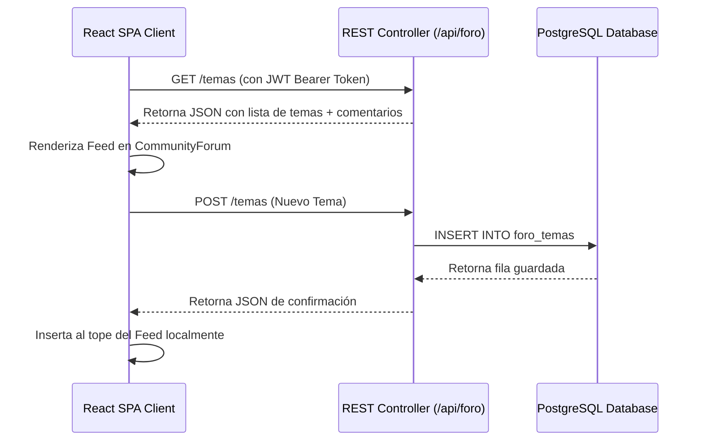

# Módulo de Comunidad y Foro Interactivo (Issue #33)

Esta guía detalla la implementación y estructura del foro comunitario de **AbrazaMente (`CommunityForum.jsx`)**. Se incluye el código completo de la creación de publicaciones (`CreateTopicModal.jsx`), hilos de conversación detallados (`DiscussionThread.jsx`) y el sistema social (chat flotante y lista de amigos).

---

## 📐 Flujo Social: Publicaciones, Respuestas y Conexión

El foro funciona mediante llamadas REST con persistencia de comentarios y control de likes:



---

## 🛠️ Código Completo del Módulo de Comunidad

### 1. Formulario de Publicación (`CreateTopicModal.jsx`)
Crea un portal modal que captura el título, mensaje y temática seleccionada por el estudiante:

```javascript
// src/features/community/CreateTopicModal.jsx
import React, { useState } from 'react';
import { X, Send } from 'lucide-react';

export default function CreateTopicModal({ isOpen, onClose, onSubmitTopic, categories }) {
  const [title, setTitle] = useState('');
  const [content, setContent] = useState('');
  const [category, setCategory] = useState(categories[0] || 'General');

  if (!isOpen) return null;

  const handleSubmit = (e) => {
    e.preventDefault();
    if (!title.trim() || !content.trim()) return;
    onSubmitTopic({ titulo: title, contenido: content, categoria: category });
    setTitle('');
    setContent('');
    onClose();
  };

  return (
    <div className="fixed inset-0 bg-black/70 backdrop-blur-sm z-50 flex items-center justify-center p-4">
      <div className="bg-[#1E1E20] border border-white/15 rounded-3xl w-full max-w-lg p-6 relative shadow-2xl">
        
        {/* Cabecera del modal */}
        <div className="flex justify-between items-center mb-5 pb-3 border-b border-white/10">
          <h3 className="text-lg font-bold text-white">Publicar en la comunidad</h3>
          <button onClick={onClose} className="text-gray-400 hover:text-white transition">
            <X className="w-5 h-5" />
          </button>
        </div>

        {/* Formulario */}
        <form onSubmit={handleSubmit} className="space-y-4">
          <div>
            <label className="block text-xs font-bold text-gray-400 mb-1.5 uppercase">Temática del foro</label>
            <select
              value={category}
              onChange={(e) => setCategory(e.target.value)}
              className="w-full bg-white/5 border border-white/10 rounded-xl px-3 py-2.5 text-sm text-white focus:outline-none focus:border-blue-500"
            >
              {categories.map(cat => (
                <option key={cat} value={cat} className="bg-[#1E1E20]">{cat}</option>
              ))}
            </select>
          </div>

          <div>
            <label className="block text-xs font-bold text-gray-400 mb-1.5 uppercase">Título</label>
            <input
              type="text"
              value={title}
              onChange={(e) => setTitle(e.target.value)}
              placeholder="Sé descriptivo con tu duda o pensamiento..."
              className="w-full bg-white/5 border border-white/10 rounded-xl px-3.5 py-2.5 text-sm text-white focus:outline-none focus:border-blue-500"
              required
            />
          </div>

          <div>
            <label className="block text-xs font-bold text-gray-400 mb-1.5 uppercase">Mensaje o Pregunta</label>
            <textarea
              value={content}
              onChange={(e) => setContent(e.target.value)}
              rows="5"
              placeholder="¿Qué estás pensando o sintiendo hoy? Compártelo en este espacio seguro y moderado..."
              className="w-full bg-white/5 border border-white/10 rounded-xl px-3.5 py-2.5 text-sm text-white focus:outline-none focus:border-blue-500 resize-none leading-relaxed"
              required
            />
          </div>

          <button
            type="submit"
            className="w-full flex items-center justify-center gap-2 bg-blue-600 hover:bg-blue-500 text-white font-bold py-3.5 rounded-2xl transition shadow-lg shadow-blue-600/10"
          >
            <Send className="w-4 h-4" /> Publicar ahora
          </button>
        </form>
      </div>
    </div>
  );
}
```

---

### 2. Hilo Detallado de Conversación (`DiscussionThread.jsx`)
Muestra el desglose del tema seleccionado, con soporte para sumar Likes de forma asíncrona y responder en tiempo real:

```javascript
// src/features/community/DiscussionThread.jsx
import React, { useState } from 'react';
import { ArrowLeft, MessageSquare, ThumbsUp, User } from 'lucide-react';

export default function DiscussionThread({ topic, onBack, onAddComment, onLikeTopic }) {
  const [newComment, setNewComment] = useState('');

  const handleSubmit = (e) => {
    e.preventDefault();
    if (!newComment.trim()) return;
    onAddComment(topic.id, newComment);
    setNewComment('');
  };

  return (
    <div className="space-y-6">
      
      {/* Botón Volver */}
      <button onClick={onBack} className="flex items-center gap-2 text-xs text-gray-400 hover:text-white transition">
        <ArrowLeft className="w-4.5 h-4.5" /> Volver al foro de la comunidad
      </button>

      {/* Tarjeta Principal del Tema */}
      <div className="bg-white/5 border border-white/10 rounded-2xl p-6 space-y-4 shadow-xl">
        <div className="flex justify-between items-center">
          <span className="bg-blue-500/15 text-blue-400 border border-blue-500/20 px-3 py-0.5 rounded-lg text-xs font-bold uppercase tracking-wider">
            {topic.categoria}
          </span>
          <span className="text-xs text-gray-400">{topic.fecha || 'Reciente'}</span>
        </div>

        <h3 className="text-lg font-bold text-white leading-snug">{topic.titulo}</h3>
        <p className="text-sm text-gray-300 whitespace-pre-line leading-relaxed">{topic.contenido}</p>

        <div className="flex gap-4 pt-4 border-t border-white/10">
          <button 
            onClick={() => onLikeTopic(topic.id)}
            className="flex items-center gap-1.5 text-xs text-gray-400 hover:text-blue-400 transition"
          >
            <ThumbsUp className="w-4 h-4" /> {topic.likes || 0} Likes
          </button>
          <span className="flex items-center gap-1.5 text-xs text-gray-400">
            <MessageSquare className="w-4 h-4" /> {topic.comentarios?.length || 0} Respuestas
          </span>
        </div>
      </div>

      {/* Respuestas de la Comunidad */}
      <div className="space-y-3 pl-4 border-l-2 border-white/10">
        <h4 className="text-xs font-bold text-gray-400 uppercase tracking-widest mb-3">Respuestas</h4>
        
        {(!topic.comentarios || topic.comentarios.length === 0) ? (
          <p className="text-xs text-gray-500 italic py-2">No hay comentarios en este hilo. ¡Sé el primero en aportar!</p>
        ) : (
          topic.comentarios.map((c, i) => (
            <div key={i} className="bg-white/5 border border-white/5 p-4 rounded-xl space-y-2 shadow-sm">
              <div className="flex justify-between text-xs text-gray-400">
                <span className="font-semibold text-gray-300 flex items-center gap-1">
                  <div className="w-4 h-4 rounded-full bg-blue-600/30 text-blue-300 text-[8px] flex items-center justify-center font-bold uppercase">
                    {c.autor ? c.autor.charAt(0) : 'U'}
                  </div>
                  {c.autor || 'Anónimo'}
                </span>
                <span>{c.fecha || 'Reciente'}</span>
              </div>
              <p className="text-xs text-gray-300 leading-relaxed">{c.texto}</p>
            </div>
          ))
        )}
      </div>

      {/* Formulario de Comentario */}
      <form onSubmit={handleSubmit} className="flex gap-3 pt-2">
        <input
          type="text"
          value={newComment}
          onChange={(e) => setNewComment(e.target.value)}
          placeholder="Aporta con un mensaje empático o consejo de autocuidado..."
          className="flex-1 bg-white/5 border border-white/10 rounded-2xl px-4 py-3 text-sm text-white placeholder-gray-400 focus:outline-none focus:border-blue-500"
        />
        <button 
          type="submit"
          className="bg-blue-600 hover:bg-blue-500 text-white text-sm font-semibold px-5 py-3 rounded-2xl transition"
        >
          Enviar
        </button>
      </form>

    </div>
  );
}
```

---

### 3. Contenedor Principal con Paneles Sociales (`CommunityForum.jsx`)
Integra los hilos de conversación, la apertura de modales y los listados dinámicos con el backend:

```javascript
// src/features/community/CommunityForum.jsx
import React, { useState, useEffect } from 'react';
import { MessageSquare, PlusCircle, ThumbsUp } from 'lucide-react';
import CreateTopicModal from './CreateTopicModal';
import DiscussionThread from './DiscussionThread';

export default function CommunityForum() {
  const [topics, setTopics] = useState([]);
  const [selectedTopic, setSelectedTopic] = useState(null);
  const [isModalOpen, setIsModalOpen] = useState(false);
  const [loading, setLoading] = useState(true);

  const categories = ["Ansiedad", "Estrés Académico", "Relaciones", "Autoestima", "Meditación", "General"];

  // Cargar discusiones del foro
  useEffect(() => {
    const fetchTopics = async () => {
      try {
        setLoading(true);
        const token = localStorage.getItem('token');
        const response = await fetch('/api/foro/temas', {
          headers: {
            'Authorization': `Bearer ${token}`
          }
        });
        if (!response.ok) throw new Error();
        const data = await response.json();
        setTopics(data);
      } catch (e) {
        // Mock data de respaldo
        setTopics([
          { id: 1, titulo: "¿Cómo combatir la desconcentración en clases?", contenido: "Siento que me abrumo muy rápido con las clases de 3 horas...", categoria: "Estrés Académico", likes: 8, comentarios: [{ autor: "Clínico Jorge", texto: "Prueba la técnica Pomodoro modificada de 20 minutos." }] },
          { id: 2, titulo: "Ansiedad generalizada y respiración guiada", contenido: "Recomiendo mucho el timer de respiración 4-7-8 de la app.", categoria: "Ansiedad", likes: 15, comentarios: [] }
        ]);
      } finally {
        setLoading(false);
      }
    };
    fetchTopics();
  }, []);

  const handleCreateTopic = async (newTopic) => {
    try {
      const token = localStorage.getItem('token');
      const response = await fetch('/api/foro/temas', {
        method: 'POST',
        headers: {
          'Content-Type': 'application/json',
          'Authorization': `Bearer ${token}`
        },
        body: JSON.stringify(newTopic)
      });
      const saved = await response.json();
      setTopics([saved, ...topics]);
    } catch (e) {
      // Mock local
      const mockSaved = { id: Date.now(), ...newTopic, likes: 0, comentarios: [] };
      setTopics([mockSaved, ...topics]);
    }
  };

  const handleLike = (id) => {
    setTopics(topics.map(t => t.id === id ? { ...t, likes: t.likes + 1 } : t));
    if (selectedTopic && selectedTopic.id === id) {
      setSelectedTopic(prev => ({ ...prev, likes: prev.likes + 1 }));
    }
  };

  const handleComment = (topicId, text) => {
    const newCommentObj = { autor: "Tú", texto: text, fecha: "Hace un momento" };
    setTopics(topics.map(t => t.id === topicId ? { ...t, comentarios: [...t.comentarios, newCommentObj] } : t));
    if (selectedTopic && selectedTopic.id === topicId) {
      setSelectedTopic(prev => ({ ...prev, comentarios: [...prev.comentarios, newCommentObj] }));
    }
  };

  if (selectedTopic) {
    return (
      <DiscussionThread
        topic={selectedTopic}
        onBack={() => setSelectedTopic(null)}
        onLikeTopic={handleLike}
        onAddComment={handleComment}
      />
    );
  }

  return (
    <div className="grid grid-cols-1 lg:grid-cols-4 gap-6">
      
      {/* Columna Muro de Foros */}
      <div className="lg:col-span-3 space-y-6">
        <div className="flex justify-between items-center border-b border-white/10 pb-4">
          <div>
            <h3 className="text-xl font-bold text-white flex items-center gap-2">
              <MessageSquare className="w-5 h-5 text-blue-400" />
              Foro Comunitario
            </h3>
            <p className="text-xs text-gray-400 mt-1">Conecta, dialoga y comparte consejos en un ambiente seguro y moderado.</p>
          </div>
          <button
            onClick={() => setIsModalOpen(true)}
            className="flex items-center gap-1.5 bg-blue-600 hover:bg-blue-500 text-white text-xs font-bold px-4 py-2.5 rounded-xl transition active:scale-95 shadow-lg shadow-blue-600/10"
          >
            <PlusCircle className="w-4 h-4" /> Nuevo Tema
          </button>
        </div>

        {loading ? (
          <div className="space-y-4">
            {[1, 2].map(n => <div key={n} className="bg-white/5 border border-white/10 rounded-2xl p-6 h-36 animate-pulse" />)}
          </div>
        ) : (
          <div className="space-y-4">
            {topics.map(t => (
              <div
                key={t.id}
                onClick={() => setSelectedTopic(t)}
                className="bg-white/5 border border-white/10 hover:border-blue-500/50 p-5 rounded-2xl cursor-pointer transition-all duration-200 hover:shadow-lg hover:shadow-blue-500/5 space-y-3"
              >
                <div className="flex justify-between items-center">
                  <span className="bg-blue-500/10 text-blue-300 border border-blue-500/20 px-2 py-0.5 rounded-lg text-[9px] font-bold tracking-wider uppercase">
                    {t.categoria}
                  </span>
                  <span className="text-[10px] text-gray-400 font-semibold uppercase tracking-wider">Ver conversación</span>
                </div>
                <h4 className="text-base font-bold text-white leading-tight">{t.titulo}</h4>
                <p className="text-xs text-gray-300 line-clamp-2 leading-relaxed">{t.contenido}</p>
                <div className="flex gap-4 text-xs text-gray-400 pt-2 border-t border-white/5">
                  <span className="flex items-center gap-1"><ThumbsUp className="w-3.5 h-3.5 text-blue-400" /> {t.likes} Likes</span>
                  <span className="flex items-center gap-1"><MessageSquare className="w-3.5 h-3.5" /> {t.comentarios?.length || 0} Respuestas</span>
                </div>
              </div>
            ))}
          </div>
        )}
      </div>

      {/* Columna Social de Amistad y Chat (Sidebar) */}
      <div className="space-y-6">
        <div className="bg-white/5 border border-white/10 rounded-2xl p-5 space-y-4 shadow-lg">
          <h4 className="text-sm font-bold text-white">Sugerencias de amigos</h4>
          <div className="space-y-3">
            {['Martina Silva', 'Daniel Soto', 'Sofía Pérez'].map((name, i) => (
              <div key={i} className="flex justify-between items-center text-xs">
                <span className="text-gray-200 font-medium">{name}</span>
                <button className="bg-white/10 hover:bg-white/15 border border-white/10 px-2 py-1 rounded-lg text-white font-semibold transition">
                  Agregar
                </button>
              </div>
            ))}
          </div>
        </div>
      </div>

      <CreateTopicModal
        isOpen={isModalOpen}
        onClose={() => setIsModalOpen(false)}
        onSubmitTopic={handleCreateTopic}
        categories={categories}
      />
    </div>
  );
}
```
