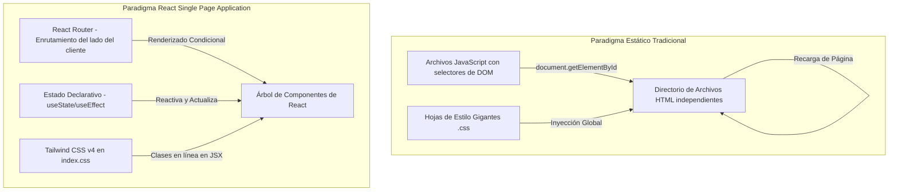

# Manual de Migración de HTML/CSS/JS Estático a React (Versión Completa)

Este manual metodológico y técnico establece los estándares, directrices y ejemplos comparativos completos para guiar a los desarrolladores en la migración de la interfaz estática original de **AbrazaMente** hacia la arquitectura moderna de **React SPA + Tailwind CSS v4**.

---

## 🧭 Flujo Comparativo de Arquitectura



---

## 📋 Equivalencias y Conversión de Estilos: CSS a Tailwind CSS v4

En AbrazaMente se implementa **Tailwind CSS v4**. A continuación se detallan las equivalencias de las clases estáticas complejas a su correspondiente código Tailwind:

| Estilo Original (CSS) | Propiedad / Concepto | Equivalencia Tailwind CSS v4 |
| :--- | :--- | :--- |
| `background: rgba(255, 255, 255, 0.05); backdrop-filter: blur(12px); border: 1px solid rgba(255, 255, 255, 0.1);` | **Glassmorphism (Efecto Cristal)** | `bg-white/5 backdrop-blur-md border border-white/10` |
| `box-shadow: 0 20px 40px rgba(0, 0, 0, 0.3);` | **Sombras profundas para paneles** | `shadow-2xl shadow-black/40` |
| `display: grid; grid-template-columns: repeat(auto-fill, minmax(280px, 1fr)); gap: 24px;` | **Grillas responsivas** | `grid grid-cols-1 md:grid-cols-2 lg:grid-cols-3 gap-6` |
| `background: linear-gradient(135deg, #3E7BFA 0%, #6600CC 100%); -webkit-background-clip: text; -webkit-text-fill-color: transparent;` | **Texto Degradado de la Marca** | `bg-gradient-to-br from-blue-500 to-purple-600 bg-clip-text text-transparent` |
| `transition: all 0.3s cubic-bezier(0.4, 0, 0.2, 1);` | **Animaciones y transiciones premium** | `transition-all duration-300 ease-out` |

---

## 🔄 Transformación Paso a Paso: Caso Práctico Completado

Para ilustrar de forma clara y aplicable el proceso de migración, se expone la transformación completa de un componente funcional.

### 🔴 Código Original Estático (HTML + CSS + JS)

#### 1. Estructura HTML (`card.html`)
```html
<div class="card" id="resource-card-101">
  <div class="card-header">
    <span class="badge badge-video">Video</span>
    <span class="premium-tag hidden">Premium</span>
  </div>
  <h3 class="card-title">Manejo de Estrés Académico</h3>
  <p class="card-description">Aprende técnicas basadas en TCC para superar los exámenes.</p>
  <div class="card-footer">
    <button class="btn-like" onclick="likeResource(101)">
      <span class="like-count">10</span> Likes
    </button>
    <button class="btn-details" id="btn-101">Ver Detalles</button>
  </div>
</div>
```

#### 2. Lógica JavaScript (`recursos.js`)
```javascript
// JS Tradicional (Manipulación imperativa de DOM)
function likeResource(id) {
  const card = document.getElementById(`resource-card-${id}`);
  const countSpan = card.querySelector('.like-count');
  let currentLikes = parseInt(countSpan.textContent);
  countSpan.textContent = currentLikes + 1;
  
  // Agregar una clase visual temporal
  countSpan.classList.add('liked-animation');
  setTimeout(() => {
    countSpan.classList.remove('liked-animation');
  }, 300);
}

document.querySelectorAll('.btn-details').forEach(button => {
  button.addEventListener('click', (e) => {
    const id = e.target.id.replace('btn-', '');
    openDetailModal(id);
  });
});
```

---

### 🟢 Código Migrado a React + Tailwind CSS v4 (Declarativo)

El código anterior se desestructura y reescribe de forma limpia, declarativa y reactiva:

```jsx
// src/features/resources/ResourceCard.jsx
import React, { useState } from 'react';
import { Video, ThumbsUp, Eye, Award } from 'lucide-react';

export default function ResourceCard({ id, title, description, initialLikes = 10, isPremium = false, onOpenDetails }) {
  // Estado local para los Likes (Manejo de estado interactivo)
  const [likes, setLikes] = useState(initialLikes);
  const [hasLiked, setHasLiked] = useState(false);

  const handleLike = () => {
    if (hasLiked) {
      setLikes(prev => prev - 1);
    } else {
      setLikes(prev => prev + 1);
    }
    setHasLiked(!hasLiked);
  };

  return (
    <div 
      className="bg-white/5 border border-white/10 hover:border-purple-500/50 p-6 rounded-2xl shadow-xl hover:shadow-purple-500/5 transition-all duration-300 flex flex-col justify-between"
      id={`resource-card-${id}`}
    >
      <div>
        {/* Cabecera del Componente */}
        <div className="flex justify-between items-center mb-4">
          <span className="flex items-center gap-1 text-xs bg-white/5 border border-white/10 px-2.5 py-1 rounded-lg text-gray-300">
            <Video className="w-3.5 h-3.5 text-purple-400" /> Video
          </span>
          
          {isPremium && (
            <span className="flex items-center gap-1 text-[10px] font-bold bg-purple-500/20 text-purple-300 border border-purple-500/30 px-2 py-0.5 rounded-md">
              <Award className="w-3.5 h-3.5" /> PREMIUM
            </span>
          )}
        </div>

        {/* Cuerpo */}
        <h3 className="text-lg font-bold text-white mb-2 leading-tight group-hover:text-purple-400">
          {title}
        </h3>
        <p className="text-sm text-gray-300 leading-relaxed mb-6">
          {description}
        </p>
      </div>

      {/* Pie de la Tarjeta */}
      <div className="flex items-center justify-between pt-4 border-t border-white/10">
        <button
          onClick={handleLike}
          className={`flex items-center gap-1.5 text-xs px-3 py-1.5 rounded-lg border transition-all active:scale-95 ${
            hasLiked 
              ? 'bg-blue-600/20 border-blue-500 text-blue-400' 
              : 'bg-white/5 border-white/10 text-gray-400 hover:text-white'
          }`}
        >
          <ThumbsUp className="w-3.5 h-3.5" />
          <span>{likes} {likes === 1 ? 'Me gusta' : 'Me gusta'}</span>
        </button>

        <button
          onClick={() => onOpenDetails(id)}
          className="flex items-center gap-1 text-xs bg-white/10 hover:bg-white/15 text-white font-medium px-3.5 py-2 rounded-xl transition"
        >
          <Eye className="w-3.5 h-3.5" /> Detalles
        </button>
      </div>
    </div>
  );
}
```

---

## 💡 Reglas Generales de Oro para el Equipo de Desarrollo

1. **No inyectar HTML de forma insegura**: Evitar el uso de `dangerouslySetInnerHTML` a menos que sea contenido previamente sanitizado.
2. **Modularizar las vistas**: Si un componente supera las 250 líneas, es un indicador de que debe dividirse en sub-componentes (ej: separar el modal del grid principal).
3. **Uso correcto de dependencias**:
   * Usar siempre **Lucide React** para iconos.
   * Usar **Framer Motion** para transiciones/animaciones en lugar de transiciones pesadas de CSS manuales.
