# Plan de Trabajo y Análisis de Requisitos para Mañana

Este documento establece un análisis de requisitos y define el plan de acción técnico paso a paso para el día de mañana, coordinando los desarrollos de frontend y backend del proyecto **AbrazaMente**.

---

## 📋 Análisis de Requisitos Pendientes

De acuerdo con la auditoría de issues y ramas, los siguientes 6 requerimientos deben ser abordados de forma prioritaria:

```mermaid
gantt
    title Planificación de Desarrollo - Mañana
    dateFormat  HH:mm
    axisFormat %H:%M
    
    section Infraestructura & Seguridad
    Configurar Rutas y ProtectedRoute (Issue #35)  :active, 09:00, 2h
    Migrar JWT a HttpOnly & Aspecto de Auditoría (Issue #30) : 11:00, 2h30m
    
    section Lógica de Negocio / Frontend
    Módulo de Biblioteca Psicoeducativa (Issue #34) : 14:30, 2h
    Módulo de Foro y Muro de Comunidad (Issue #33)  : 16:30, 2h30m
    Test GAD-7 y CDSS con Alerta Crítica (Issue #31)  : 19:00, 2h
```



---

## 🛠️ Plan de Trabajo Paso a Paso para Mañana

### Bloque 1: Rutas y Filtros de Seguridad (Mañana: 09:00 - 11:00)
1. **Creación de Rama**:
   ```bash
   git checkout -b feature/routes-protected
   ```
2. **Implementación de Guard**:
   * Codificar `src/components/ProtectedRoute.jsx` para interceptar `/comunidad` y `/journal` basándose en la presencia del token.
3. **Configuración de Enrutador**:
   * Modificar `src/App.jsx` para envolver las rutas privadas con `<Route element={<ProtectedRoute />} />`.
   * Habilitar el enrutador en `src/main.jsx`.
4. **Actualización de Cabecera**:
   * Reemplazar etiquetas `<a>` por `<NavLink>` en `src/components/Header.jsx` e inyectar clases de CSS activo (`active-tab`).

### Bloque 2: Autenticación Segura y Bitácora (Mañana: 11:00 - 13:30)
1. **Creación de Rama**:
   ```bash
   git checkout -b feature/security-httponly-audit
   ```
2. **Backend (Spring Boot)**:
   * Modificar `AuthController.java` para inyectar el token JWT en las cookies de respuesta utilizando `ResponseCookie` (con atributos `HttpOnly`, `Secure` y `SameSite=Strict`).
   * Implementar la entidad JPA `AuditLog` en la tabla `bitacora_auditoria`.
   * Crear el aspecto `AuditAspect.java` (usando Spring AOP) para interceptar acciones en `JournalEntryController` y guardar eventos.
3. **Frontend (React)**:
   * Modificar el formulario de inicio de sesión (`AuthModal.jsx`) para remover el guardado manual de tokens en `localStorage`.
   * Configurar peticiones fetch con `credentials: 'same-origin'`.

### Bloque 3: Biblioteca Psicoeducativa (Tarde: 14:30 - 16:30)
1. **Creación de Rama**:
   ```bash
   git checkout -b feature/resources-module
   ```
2. **Construcción del Módulo**:
   * Crear la barra lateral de filtros `FilterBar.jsx` con checkboxes de temas y formatos.
   * Crear la tarjeta interactiva `ResourceCard.jsx` e implementar el modal detallado del recurso y el modal de iframe de video.
   * Integrar la funcionalidad de **Vistos recientemente** mediante persistencia en `localStorage` (capado a 4 elementos).

### Bloque 4: Foro y Comunidad Interactiva (Tarde: 16:30 - 19:00)
1. **Creación de Rama**:
   ```bash
   git checkout -b feature/community-module
   ```
2. **Construcción del Módulo**:
   * Programar `CreateTopicModal.jsx` para permitir la publicación de discusiones.
   * Programar `DiscussionThread.jsx` con soporte para listado de comentarios y likes en tiempo real.
   * Integrar paneles de chat y sugerencias de amistad en `CommunityForum.jsx`.

### Bloque 5: Módulo Clínico CDSS GAD-7 (Tarde/Noche: 19:00 - 21:00)
1. **Creación de Rama**:
   ```bash
   git checkout -b feature/cdss-gad7
   ```
2. **Construcción del Módulo**:
   * Crear el cuestionario interactivo de 7 preguntas en `GAD7Survey.jsx` con barra de progreso y cálculo automático de severidad.
   * Programar el **bloqueo de pantalla crítico no descartable** si el estudiante registra ansiedad severa (score >= 15), forzando el agendamiento en `/professionals` y mostrando números de emergencia.
