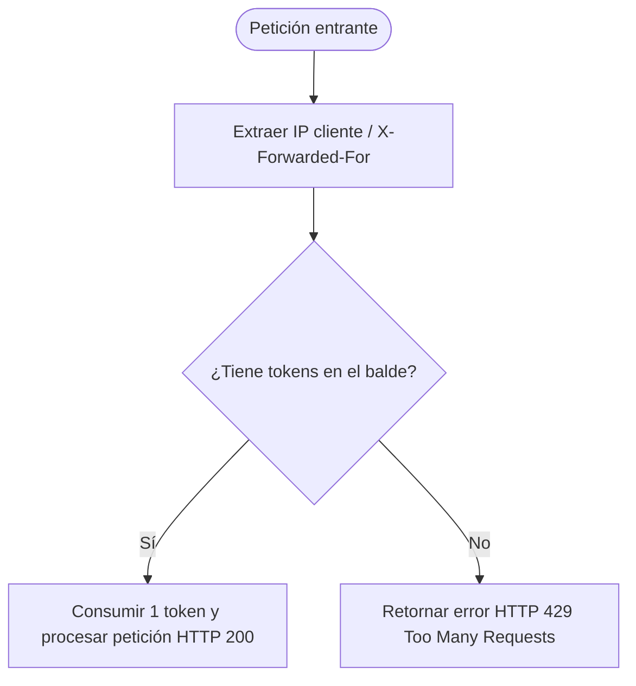

# Rate Limiting (Bucket4j) y Caching (Issue #32)

Esta guía técnica detalla la arquitectura de mitigación de abusos y optimización de rendimiento implementada en el backend de **AbrazaMente (`mental-app`)**. Se abordan dos conceptos clave: el control de solicitudes por IP empleando **Bucket4j** y la habilitación de mecanismos de caché de base de datos en los servicios de profesionales de la salud.

---

## 🛑 Rate Limiting con Bucket4j

Para proteger la plataforma contra ataques de denegación de servicio (DDoS) o intentos reiterados de intrusión de fuerza bruta (ej: en `/api/auth/login`), se configura un filtro interceptor que limita la frecuencia de peticiones basándose en la IP del cliente.



---

### 1. Dependencias en `pom.xml`
Incorpore las dependencias requeridas en el archivo pom del backend:
```xml
<!-- Bucket4j Core -->
<dependency>
    <groupId>com.github.vladimir-bukhtoyarov</groupId>
    <artifactId>bucket4j-core</artifactId>
    <version>7.6.0</version>
</dependency>
```

### 2. Filtro Interceptor `RateLimitFilter.java`
Este filtro captura las peticiones, resuelve la dirección IP origen (soportando encabezados de proxy cloud como `X-Forwarded-For`) y valida la cuota permitida (10 peticiones por minuto por IP para endpoints críticos):

```java
package com.example.demo.security;

import io.github.bucket4j.Bandwidth;
import io.github.bucket4j.Bucket;
import io.github.bucket4j.Refill;
import jakarta.servlet.*;
import jakarta.servlet.http.HttpServletRequest;
import jakarta.servlet.http.HttpServletResponse;
import org.springframework.stereotype.Component;

import java.io.IOException;
import java.time.Duration;
import java.util.Map;
import java.util.concurrent.ConcurrentHashMap;

@Component
public class RateLimitFilter implements Filter {

    // Caché en memoria para los baldes de cada dirección IP
    private final Map<String, Bucket> cache = new ConcurrentHashMap<>();

    // Crear un balde con límite de 10 peticiones por minuto con recarga continua
    private Bucket createNewBucket() {
        return Bucket.builder()
                .addLimit(Bandwidth.classic(10, Refill.intervally(10, Duration.ofMinutes(1))))
                .build();
    }

    @Override
    public void doFilter(ServletRequest request, ServletResponse response, FilterChain chain)
            throws IOException, ServletException {
        
        HttpServletRequest httpRequest = (HttpServletRequest) request;
        HttpServletResponse httpResponse = (HttpServletResponse) response;
        
        String path = httpRequest.getRequestURI();

        // Aplicar limitación únicamente a endpoints críticos
        if (path.startsWith("/api/auth/") || path.startsWith("/api/journal/")) {
            String ip = getClientIP(httpRequest);
            Bucket bucket = cache.computeIfAbsent(ip, k -> createNewBucket());

            if (!bucket.tryConsume(1)) {
                httpResponse.setStatus(429); // Too Many Requests
                httpResponse.setContentType("application/json");
                httpResponse.getWriter().write("{\"error\": \"Too many requests\", \"message\": \"Has excedido el límite de solicitudes por minuto. Por favor, intenta más tarde.\"}");
                return;
            }
        }

        chain.doFilter(request, response);
    }

    private String getClientIP(HttpServletRequest request) {
        String xfHeader = request.getHeader("X-Forwarded-For");
        if (xfHeader == null) {
            return request.getRemoteAddr();
        }
        return xfHeader.split(",")[0]; // Retorna la IP original detrás de proxies/balaceadores
    }
}
```

---

## ⚡ Caching en Spring Boot para Consultas Repetitivas

El catálogo de psicólogos clínicos y terapeutas (`ProfessionalController`) es una de las pantallas más consultadas por los estudiantes. Para evitar consultas innecesarias a la base de datos Neon en la nube en cada renderizado del catálogo, se activa la caché en memoria del lado del servidor.

### 1. Habilitar la Caché en la Configuración
Añada la anotación `@EnableCaching` en el punto de entrada de la aplicación de Spring Boot:

```java
package com.example.demo;

import org.springframework.boot.SpringApplication;
import org.springframework.boot.autoconfigure.SpringBootApplication;
import org.springframework.cache.annotation.EnableCaching;

@SpringBootApplication
@EnableCaching // Habilitación global del middleware de caché
public class DemoApplication {
    public static void main(String[] args) {
        SpringApplication.run(DemoApplication.class, args);
    }
}
```

### 2. Anotaciones de Persistencia en `ProfessionalService.java`
Utilice la anotación `@Cacheable` para guardar los resultados del catálogo e invalidarla con `@CacheEvict` al registrar nuevos profesionales clínicos:

```java
package com.example.demo.service;

import com.example.demo.model.Professional;
import com.example.demo.repository.ProfessionalRepository;
import org.springframework.cache.annotation.CacheEvict;
import org.springframework.cache.annotation.Cacheable;
import org.springframework.stereotype.Service;
import java.util.List;

@Service
public class ProfessionalService {

    private final ProfessionalRepository professionalRepository;

    public ProfessionalService(ProfessionalRepository professionalRepository) {
        this.professionalRepository = professionalRepository;
    }

    /**
     * Cachea los resultados de la consulta de profesionales verificados.
     * La próxima vez que se llame a esta función, Spring retornará el listado en memoria.
     */
    @Cacheable(value = "professionalsCache")
    public List<Professional> getAllVerifiedProfessionals() {
        System.out.println("Caché Miss: Consultando profesionales en la base de datos Neon...");
        return professionalRepository.findAll(); // Consulta relacional pesada
    }

    /**
     * Limpia la caché activa para obligar a una recarga de datos cuando un
     * profesional actualiza su estado o se registra uno nuevo.
     */
    @CacheEvict(value = "professionalsCache", allEntries = true)
    public Professional saveProfessional(Professional professional) {
        System.out.println("Limpiando professionalsCache debido a inserción/edición.");
        return professionalRepository.save(professional);
    }
}
```
